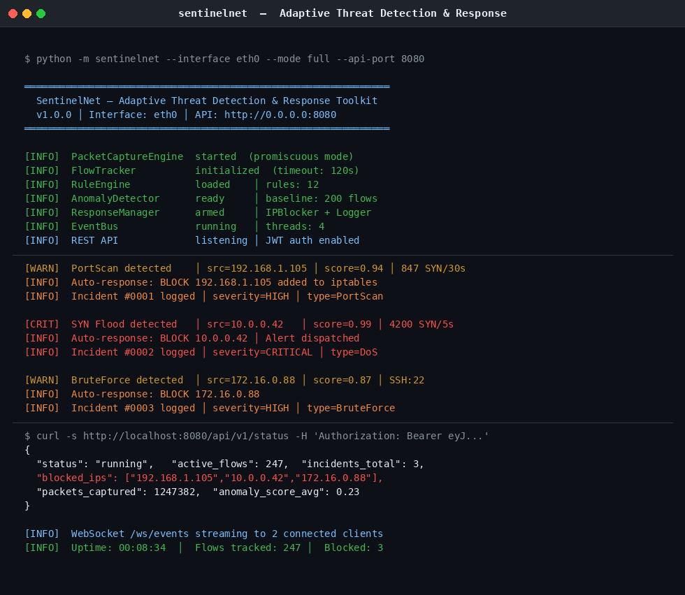

# SentinelNet

[](https://github.com/garrv105/sentinelnet/actions/workflows/ci.yml)
[](https://www.python.org/)
[](LICENSE)
[](https://github.com/psf/black)
[](https://github.com/PyCQA/bandit)
[](docker/Dockerfile)

**Adaptive Network Threat Detection & Automated Response Toolkit**

SentinelNet is a production-grade, deployable network security monitoring system. It performs real-time packet capture, reconstructs bidirectional flows, detects threats using a hybrid rule engine and ML-based anomaly detector, and automatically responds by blocking malicious IPs — all exposed through a secured REST API and WebSocket stream.

---

## Demo



---

## Features

| Capability | Detail |
|---|---|
| **Real-time capture** | Scapy-based promiscuous packet capture on any interface |
| **Flow reconstruction** | Bidirectional TCP/UDP flow tracking with IAT, byte, and flag statistics |
| **Rule engine** | Signature-based detection: PortScan, SYN Flood, DNS Tunnel, Brute Force |
| **Anomaly detection** | Per-IP behavioral profiling with statistical deviation scoring |
| **Auto-response** | iptables IP blocking, incident logging, alerting via EventBus |
| **REST API** | FastAPI with JWT + API key auth, rate limiting, security headers |
| **WebSocket** | Real-time event streaming for dashboards / SIEM integration |
| **PCAP loader** | Convert raw `.pcap` / `.pcapng` files → labeled flow feature datasets |
| **Docker** | Single-command deployment with `docker-compose up` |

---

## Architecture

```
Packets (eth0/any)
       │
       ▼
PacketCaptureEngine  ──►  FlowTracker  ──►  FeatureExtractor
                                                     │
                              ┌──────────────────────┤
                              ▼                      ▼
                        RuleEngine          AnomalyDetector
                              │                      │
                              └──────────┬───────────┘
                                         ▼
                                      EventBus
                                         │
                              ┌──────────┴───────────┐
                              ▼                      ▼
                       ResponseManager          REST API / WS
                    (IPBlocker + Logger)    (JWT auth + slowapi)
```

---

## Quick Start

### Docker (recommended)

```bash
git clone https://github.com/garrv105/sentinelnet.git
cd sentinelnet
docker-compose -f docker/docker-compose.yml up
```

### Local

```bash
pip install -e ".[dev]"

# Requires root for live packet capture
sudo python -m sentinelnet --interface eth0 --mode full --api-port 8080

# Simulate traffic without root (for testing)
python scripts/simulate_traffic.py
```

---

## API Authentication

```bash
# 1. Get a JWT token
curl -X POST http://localhost:8080/auth/token \
  -d "username=admin&password=changeme"

# 2. Use the token
curl http://localhost:8080/api/v1/status \
  -H "Authorization: Bearer <token>"

# 3. Or use an API key (set SENTINELNET_API_KEYS env var)
curl http://localhost:8080/api/v1/incidents \
  -H "X-API-Key: your-key-here"
```

API docs available at `http://localhost:8080/docs` (Swagger UI).

---

## PCAP Dataset Loader

Convert any PCAP capture to a labeled flow feature dataset:

```python
from sentinelnet.data.pcap_loader import extract_flows_from_pcap, load_pcap_directory

# Single file
df = extract_flows_from_pcap("capture.pcap", label="NORMAL", output_csv="flows.csv")

# Batch directory with auto-labeling by filename
df = load_pcap_directory(
    "/data/pcaps/",
    label_map={"normal": "NORMAL", "dos": "DoS", "scan": "PortScan"},
    output_csv="labeled_flows.csv",
)
```

Supports CICFlowMeter CSV output, raw PCAP/PCAPNG, and the CAIDA / CTU-13 / UNSW-NB15 dataset formats.

---

## Testing

```bash
pip install -e ".[dev]"
pytest tests/ -v --cov=sentinelnet
```

Test coverage across: `PacketCaptureEngine`, `FlowTracker`, `RuleEngine`, `AnomalyDetector`, `EventBus`, `ResponseManager` — 40+ test cases.

---

## CI/CD Pipeline

Five-job GitHub Actions workflow on every push and PR:

| Job | Description |
|---|---|
| **Lint** | ruff + black + isort |
| **Test** | pytest on Python 3.10 / 3.11 / 3.12 with coverage |
| **Security** | bandit static analysis + pip-audit |
| **Docker** | Build image, verify layers |
| **Release** | Build wheel artifact on `main` |

---

## Configuration

All settings in `config/sentinelnet.yaml` and environment variables:

```bash
SENTINELNET_JWT_SECRET=<openssl rand -hex 32>
SENTINELNET_ADMIN_PASS_HASH=<bcrypt hash>
SENTINELNET_API_KEYS=key1,key2
SENTINELNET_CORS_ORIGINS=https://yourdomain.com
```

---

## Security Note

SentinelNet requires root/CAP_NET_RAW for live packet capture. The API server itself runs unprivileged. For production deployment, run the capture component via `sudo` or with Linux capabilities, and the API server behind a reverse proxy (nginx/Caddy).

---

## License

MIT — see [LICENSE](LICENSE)

---

*Built as part of a production-grade cybersecurity portfolio. Part of a three-project suite alongside [XAI-IDS](https://github.com/garrv105/xai-ids) and [PQC-Analyzer](https://github.com/garrv105/pqc-analyzer).*
